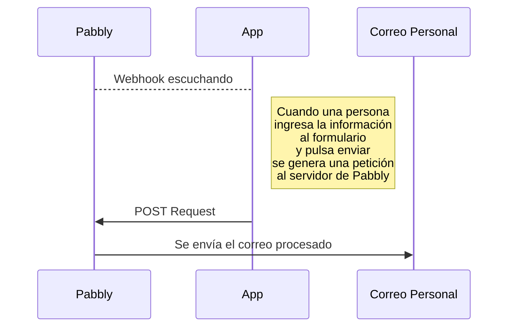

> # StreamlitNews
[](https://eedx-news.streamlit.app)

## Resumen
StreamlitNews es una aplicación creada para analizar noticias e información relevante en Colombia empleando Inteligencia Artificial, cuyo funcionamiento permite tanto el aprendizaje de nuevos conocimientos, como el apoyo al momento de ingresar a sitios de noticias, ya que facilita algunas tareas llevadas a cabo por los humanos de una manera visual y sencilla.

## Funcionamiento
Para ejecutar el código de la extracción o modelado de datos (encontrados en la carpeta **notebooks**) será necesario instalar las dependencias con el nombre `nb_requirements.txt`, las cuales difieren en algunos paquetes de los requisitos de la app principal, por lo que se encuentran separados. Se recomienda hacer uso de la interfaz de Google Colab, ya que facilita la ejecución del código, y ambos archivos pueden encontrarse con su información detallada y un paso a paso sencillo de seguir:

- **Extracción de datos** (`Analisis_de_noticias_E1.ipynb`): Para este archivo será necesaria una llave API de [newsapi.ai](https://newsapi.ai/), herramienta empleada para obtener la base de datos de noticias, cuyos parámetros de búsqueda se encuentran especificados en el notebook para generar resultados reproducibles.
  
[](https://colab.research.google.com/drive/1LGyeJ74Oy1ixMHJuTEv-tgegAuyHmx1h?usp=sharing)

- **Modelado de datos con Langchain y Ollama** (`Analisis_de_noticias_E2.ipynb`): La ejecución de este archivo requiere de la activación de GPU, ya que el modelo seleccionado ocupa aproximadamente 6 GB de memoria, y puede encontrarse en el sitio de Ollama [llama3.1:8b-instruct-q4_1](https://ollama.com/library/llama3.1:8b-instruct-q4_1). Sin embargo, se recomienda realizar pruebas con el modelo [llama3.1:8b-instruct-fp16](https://ollama.com/library/llama3.1:8b-instruct-fp16), el cual ocupa 16 GB de memoria, pero genera resultados mucho más confiables, debido a que los observados en este notebook presentaron una cantidad significativa de errores al realizar la clasificación.
  
[](https://colab.research.google.com/drive/17rvpBJ_ByemVUQGadFEOsocVnnjgHURL?usp=sharing)

Por otra parte, la aplicación principal (`app.py`), puede ser ejecutada realizando la instalación de las dependencias encontradas en el archivo `requirements.txt`, en compañía de una llave API de [OpenAI](https://openai.com/), cuyo modelo GPT-4o-mini impulsó el desarrollo de las herramientas encontradas en el sitio de Streamlit del proyecto, como el **Analizador de Noticias** y el **Chatbot Educativo**; de igual manera, para activar el servicio de recepción de correos electrónicos en la sección de contacto se hizo uso de [Pabbly Connect](https://www.pabbly.com/), con un flujo de trabajo como el explicado a continuación:



Para activar el servidor de Streamlit, tanto en local como en GitHub Codespaces, se ejecuta en la terminal el siguiente comando luego de instalar las dependencias:

```bash
streamlit run app.py
```

## Recomendaciones
- En caso de utilizar este proyecto como base para desarrollar otros similares, será necesario modificar la página `about_me.py`, ya que la misma contiene información personal, y no debe ser utilizada por terceros.

- El Chatbot y el Analizador de Noticias están configurados para operar con mayor exactitud sobre temas como la desinformación, educación, medios informativos y política colombiana, lo que puede adaptarse a cualquier otro país o entorno en que se desee enfocar el desarrollo solo con cambiar los prompts utilizados en `chatbot.py` y `text_analyzer.py`.

## Información sobre este proyecto
Toda la información relevante, como el desarrollo, planteamiento y metodología seguidas para llevar a cabo este proyecto puede encontrarse en el siguiente enlace de Streamlit, el cual se ubicó por comodidad dentro de la sección de `Acerca de` del sitio web.

[](https://eedx-news.streamlit.app/about_tool)
